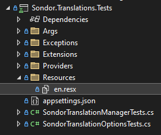
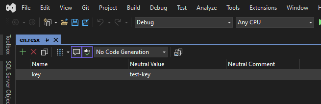

# Sondor Translations
Sondor Translations is a library for managing application settings in .NET applications.
It provides a simple and flexible way to define,validate, and access application options.

## Options
| Name | Description | Required | Default |
| --- | --- | --- | --- |
| `DefaultCulture` | The default culture the application will use, when not set. | `True` | `en` |
| `SupportedCultures` | The collection of cultures the application supports. | `True` | `en, en-GB, en-FR` |
| `UseKeyAsDefaultValue` | When true, returns the translation key when a value is not found and a default value was not provided. | `True` | `True` |

## Getting Started
1. Add options to your configuration, the default section name of `SondorTranslationOptions` can be overridden when when calling `services.AddSondorTranslations`.
```json
{
  "SondorTranslationOptions": {
    "DefaultCulture": "en",
    "SupportedCultures": [
      "en",
      "en-GB",
      "en-US"
    ],
    "UseKeyAsDefaultValue": true
  }
}
```
2. Call `services.AddSondorTranslations` to setup the application ready to use translations.
```csharp
services.AddSondorTranslations(settings: "SondorTranslationOptions",
  providers: null);
```
3. Add `Sondor.Translations` namespace and add `ISondorTranslationManager` to your constructor.
```csharp
using Sondor.Translations;

/// <summary>
/// The example class.
/// </summary>
public class Example {
  /// <summary>
  /// Creates a new instance of <see cref="Example"/>.
  /// </summary>
  /// <param name="translationManager">The translation manager.</param>
  public Example(ISondorTranslationManager translationManager) {
  }
}
```
4. Now, follow the guides below to read translations respective of your chosen method
   - [How to use resource files](#how-to-use-resource-files)
   - [How to use JSON file translation provider](#how-to-use-json-file-translation-provider)

## How to use resource files
1. Create the resource (`.resx`) file in the desired directory.
   - Take note of the location, as the namespace path will be required when reading translations.
   - When creating the `resx` file, ensure to name it for the after the culture translations it'll store. Example: `en.resx` for `en` culture translations.
   - The namespace for the example below - `Sondor.Translations.Tests`.



2. Open the resource file, I'd recommend using Visual Studio as it provides a user friendly UI.



3. Now read a translation as shown below
```csharp
_translationManager.Translate(key: "key",
  location: "Sondor.Translations.Tests",
  resource: "Resources.en");
```

## How to use JSON file translation provider
1. Create translations file `C:\translations\en.json`
```json
{
  "en": [
    {
      "Key": "key-1",
      "Value": "value-1"
    },{
      "Key": "key-2",
      "Value": "value-2"
    },
    {
      "Key": "key-3",
      "Value": "value-3"
    }
  ]
}
```
2. Now read a translation as shown below
```csharp
await _translationManager.TranslateAsync(key: "key");
```